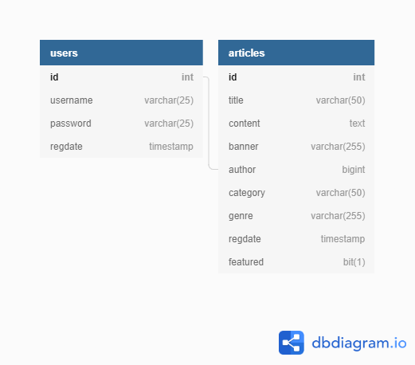

Table users{

  id int [pk, increment]
  
  username varchar(25) [not null]
  
  password varchar(25) [not null]
  
  regdate timestamp [not null, default: 'now()']
  
 
}

Table articles{

  id int [pk, increment] 
  
  title varchar(50) [not null]
  
  content text [not null]
  
  banner varchar(255) [not null]
  
  author bigint [not null]
  
  category varchar(50) [not null]
  
  genre varchar(255) [not null]
  
  regdate timestamp [not null, default: 'now()']
  
  featured bit(1) 
  
}

Ref: "articles"."author" < "users"."id"